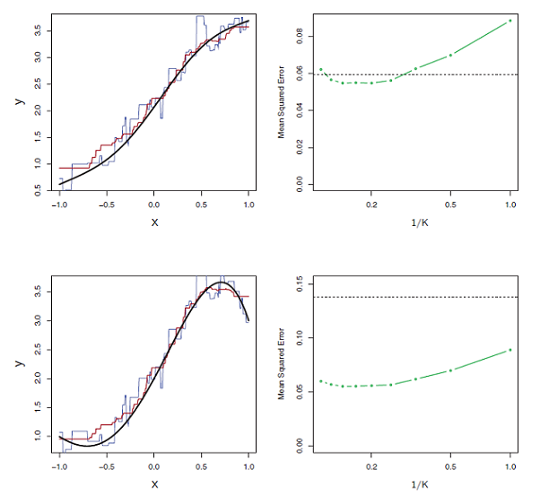

## Washington State Schools

- Low math test pass rates (low income students)
- Peer-wise comparison
- K nearest-neighbors (KNN)


## KNN (K=3)

```{r, echo=FALSE, message=FALSE}
library(dplyr)
library(ggplot2)
library(magrittr)
set.seed(76)

knn_example <- data.frame(runif(30,0,10))
colnames(knn_example) <- c("x")
knn_example %<>% mutate(y=3*x,error=rnorm(30,0,1),yhat=y+error)
knn_example %<>% mutate(euclid_4 = abs(4-x))
knn_example %<>% mutate(three_closest = ifelse(euclid_4 %in% head(sort(knn_example$euclid_4),3), "Yes","No"))

ggplot(aes(x, yhat), data=knn_example) + geom_point(aes(col=three_closest, size=4)) +
  geom_smooth(method="lm", se=FALSE) +
  scale_color_manual(values=c("black","red")) + 
  scale_x_continuous(breaks=seq(0,10,2)) +
  geom_vline(xintercept=4, color="red", linetype="dashed") +
  theme(legend.position="none") +
  ggtitle("K = 3")

knn_example %>% filter(three_closest=="Yes") %>% summarise(mean(yhat))
```

## KNN (K=10)

```{r, echo=FALSE}
knn_example %<>% mutate(ten_closest = ifelse(euclid_4 %in% head(sort(knn_example$euclid_4),10), "Yes","No"))

ggplot(aes(x, yhat), data=knn_example) + geom_point(aes(col=ten_closest, size=4)) +
  geom_smooth(method="lm", se=FALSE) +
  scale_color_manual(values=c("black","red")) + 
  scale_x_continuous(breaks=seq(0,10,2)) +
  geom_vline(xintercept=4, color="red", linetype="dashed") +
  theme(legend.position="none") +
  ggtitle("K = 10")

knn_example %>% filter(ten_closest=="Yes") %>% summarise(mean(yhat))

```

## Versus Linear Regression?

- Using MSE as criteria (Blue: K=1, Red: K=9)

 


## Basic Advantages of KNN over Linear Regression

- Fits non-linear models better
- Even if model is linear, if n >> p then still performs roughly as well as linear regression
- Not strongly affected by influential outliers

## KNN vs Linear Regression for WA School Data

- Predict mathLImet with LowIncome (-), ELL (+), and Enrollment (-1)
- Average data over years
- Delete observations w/ missing data (scrapped grad rate)
- Normalize predictors for KNN with IQR

## Why IQR?

```{r, echo=FALSE, message=FALSE}
library(qpcR)
library(FNN)


data <- read.csv("WA_schools_data.csv")

grouped_data <- data %>% group_by(School, SchoolCategory, District, SchoolType) %>%
  summarise(mathNLImet = mean(mathNLImet, na.rm=TRUE), 
            mathLImet = mean(mathLImet, na.rm=TRUE),
            LowIncome = mean(LowIncome, na.rm=TRUE),
            ELL = mean(ELL, na.rm=TRUE),
            SpecialEd = mean(SpecialEd, na.rm=TRUE),
            Enrollment = mean(Enrollment, na.rm=TRUE),
            NLIGradRate = mean(NLIGradRate, na.rm=TRUE),
            LIGradRate = mean(LIGradRate, na.rm=TRUE)
            )

knn_rmse <- function(knn_model,test_response){
  df.knn_model <- knn_model$pred %>% as.matrix() %>% as.data.frame()
  d <- bind_cols(df.knn_model,test_response)
  colnames(d) <- c("pred","actual")
  d %<>% mutate(error=pred-actual)
  mse <- (1/length(d$error))*sum(d$error^2)
  rmse <- sqrt(mse)
  return(rmse)
  
}

final_data <- grouped_data %>% dplyr::select(-NLIGradRate,-LIGradRate,-mathNLImet)

final_data %<>% na.omit()

final_data_2 <- final_data %>% filter(LowIncome != 0)

qplot(x=ELL, geom="histogram", data=final_data_2)
```

## Comparison

```{r, echo=FALSE}


knn_data <- final_data_2 %>% mutate(LowIncome=LowIncome/IQR(final_data_2$LowIncome),
                                    ELL=ELL/IQR(final_data_2$ELL),
                                    SpecialEd=SpecialEd/IQR(final_data_2$SpecialEd),
                                    Enrollment=Enrollment/IQR(final_data_2$Enrollment))

set.seed(76)
ind <- sample(2, nrow(knn_data), replace=TRUE, prob=c(0.67, 0.33))

knn_training <- knn_data[ind==1,c(6,7,9)]
knn_test <- knn_data[ind==2,c(6,7,9)]
knn_training_response <- final_data_2[ind==1,"mathLImet"]
knn_test_response <- final_data_2[ind==2,"mathLImet"]

lm_training <- final_data_2[ind==1,]
lm_test <- final_data_2[ind==2,]

lm_model <- lm(mathLImet~LowIncome + ELL + Enrollment, data=lm_training)

lm_model_test <- predict(lm_model,newdata=lm_test)
lm_model_rmse <- sqrt((1/length(lm_model_test)) * sum((lm_model_test-lm_test$mathLImet)^2))

lowest <- data.frame(NA,NA) %>% na.omit()
colnames(lowest) <- c("k","rmse")

for (k in 1:30){
  knn_model <- knn.reg(train=knn_training, test=knn_test, y=knn_training_response$mathLImet, k=k)
  rmse <- knn_rmse(knn_model,knn_test_response)
  lowest %<>% bind_rows(data.frame(k,rmse))
}
```
```{r}
lm_model_rmse
lowest %>% arrange(rmse)
```


